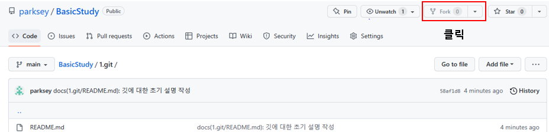
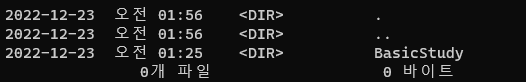
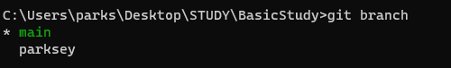
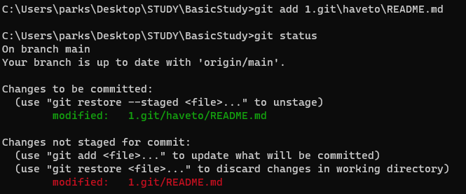
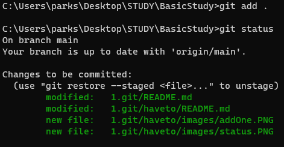

# **Git 필수 사항**

## 프로젝트 fork
> 초기 1번만 하면 된다.

### 1. 레포지토리 FORK하기
> fork는 다른이의 계정의 저장소를 그대로 내게 가져오는 기능입니다.
> 내가 해당 프로젝트에 참여하고 있지 않거나 다른이의 프로젝트에서 `변경을 원할 때 사용`합니다.



fork를 하게 된다면 git에는 `parksey/BasicStudy`에서 `{자신의 Git Id}/BasicStudy`로 변경된다.

---
### 2. Git clone 하기
> Cmd 창에서 git에 있는 저장소에서 내 컴퓨터에 가져오는 역할을 합니다.

- 이렇게 저장소에 있는 데이터는 그대로 놔두고 복사하여 내 컴퓨터에 가져온 데이터만 변경을 하며,
- 변경이 완성되면 다시 `push`하여 원격 저장소에 새로 저장합니다.

```
git clone https://github.com/{본인 아이디}/{저장소 이름}/.git
Ex) git clone https://github.com/parksey/BasicStudy.git
```



---
### 3. 자신만의 Branch 생성
> 서로 다른 작업을 동시에 진행하면서 또 서로에게 영향을 주면 안됩니다.
> 만약 영향을 주게 된다면 다른 사람이 변경한 내용을 모를 수도 있기때문에 별도의 공간을 만들어 진행합니다.

```
git checkout -b {본인의 아이디}
Ex) git checkout -b parksey
```
- 새로운 branch를 만들어서 해당 브랜치로 전환합니다.
- `git branch`를 통해 branch의 리스트를 확인할 수 있다.



---
### 4. 자신이 사용할 IDE에서 불러온 후 코드 시작
- 각 IDE에서 `clone`한 폴더를 열어서 시작하면 됩니다.

---
### 5. 작성 후 작업한 목록 올리기
> 작성을 다 했다고 끝나는 것이 아닙니다. 작성한 것을 올려야하는데 `add`와 `commit`을 사용합니다.

#### **add**
> git에 `올릴 파일`과 `올리지 않을 파일`을 구분해서 올려야 합니다. 실수라도 중요한 비밀번호를 가지고 있는 파일을 올릴 수는 없으니까요
> 따라서 올릴 파일만 선택하는 것이 `add`입니다.

```
git add 파일
git add .
```
- 위에는 하나의 파일만 올린 것입니다.


- `아래(.)`는 변경된 전체 파일을 올린 것입니다.


#### **commit**
> 선정된 파일을 이제 원격 저장소에 올려야 합니다.

```
git commit -m "메세지 내용"
```


### 올릴 양도 많지만 올리면 안되는 내용도 많을때
> 말 그대로 `git add .`처럼 전체를 올리고 싶지만 제외해야할 파일이 1~2개가 아닐때 입니다.

- `.gitignore`파일을 생성한다. 
- 해당 파일 이름들을 추가하여 올리면 됩니다.
- 그렇게 되면 해당 이름을 가진 모든 파일들을 git add에 포함하지 않게 됩니다.


- 구글에 추가하고 싶은 `.gitignore` 내용을 검색하면 공통으로 제외하는 파일들을 올려놓았다
- 참고하여 하면 된다.